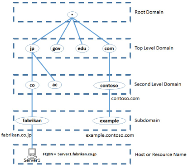
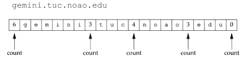
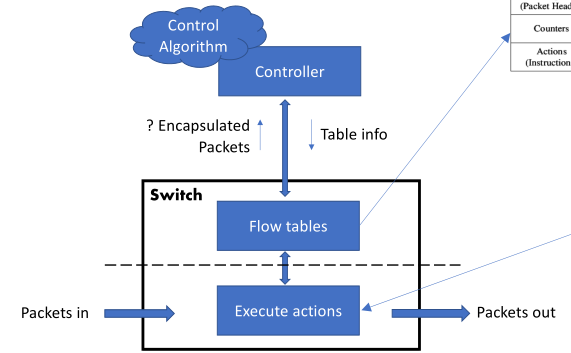

# GRS

## Management vs. Operations

- **Management**:
  - Conceptual, high-level dimensions to keep network running smoothly;
  - **Smoothly**: Quality of Experience (QoE), reliability, security, etc.
  - Manage monitoring, configurations, performance, faults, security,
    accounting, etc.
- **Operations**:
  - People, processes, and tools to make management happen; Typically in the
    network operations center.

## Dimensions of networking

### Packets

- **Data plane**:
  - Packet switch and forwarding (microseconds);
  - Looks up rules, e.g., packet header, in/out interfaces, time-slot;
- **Control plane**:
  - **Switching control/Network functions** (milliseconds): routing, Quality of
    Service (QoS), firewall, etc.
  - Reacts to changes (interfaces, links, etc.);
  - Control is centralized or distributed (neighboring routers);
  - Update switching rules.
- **Network services** (DHCP, DNS, Radius, LDAP, etc.) (milliseconds):
  - Provide mapping: MAC-IP, IP-Domain name, accounting, etc.

### Management

- Configuration - Provisioning, software updates, structural changes, minor
  configuration changes;
- Performance assessment;
- Accountability;
- Fault management;
- Security.

## Changing network topologies

- **Spanning Tree** - focus on Ethernet reliability while avoiding loops;
- **Fat tree** - focus on bandwidth between nodes;
- Clos network, crossbar switch, multistage:
  - Strict-sense nonblocking: unused input => unused output;
  - Rearrangeably nonblocking: need to rearrange the connections between middle
    switches.
- Traffic demands:
  - North-south (computer to Internet), typical enterprise - spanning tree;
  - East-west (computer to computer), data center - fat tree.

## Services and systems

- Traditional network-based services:
  - Mail, web, storage (NAS/SAN), database, etc.
- **Systems** - more complex services, e.g.:
  - Three tier applications: database backends, user-facing applications,
    application;
  - Micro-services, REST APIs, publish-subscribe;
  - Big data.

## Devops in the cloud

- **Traditional** release deployment:
  - Gather specifications;
  - UML architecture diagrams;
  - Implement, test, deploy;
  - **Fence between _dev team_ and _ops team_**;
  - Dev not consider operational requirements;
  - Broken deployments => long feedback to dev.
- **Devops** approach:
  - Quick deployment cycle (agile, test-driven, sprints);
  - Write code thinking about other phases (deployment, testing, etc.);
  - Build rather than buy;
  - Automate test and deployment (repeatable and predictable);
  - Embrace failure: fail fast, find errors/vulnerabilities, recover quickly.

## Devops for networking

- Cloud environment easier because it's virtual;
- Network is _hard_:
  - Physical limitations (e.g., cables, device access);
  - Hard to control (heterogeneous device API);
  - Complex (multiple protocols, topologies);
  - Hardware bundle (switching, routing, etc. in the same closed box).
- If possible:
  - Quick deployment;
  - Predictable deployment;
  - Fail fast;
  - Build rather than buy.

### How to

- Virtual networks;
- Software-defined networks (can use SDN);
- Network function virtualization (enables running network functions in generic
  hardware);
- Programmatic device interfaces;
- Anyone can write code.

## FCAPS

Framework for network management.

- Fault;
- Configuration;
- Accounting;
- Performance;
- Security.

**Monitoring entra em todas exceto configuration.**

## Network Operation Center (NOC)

Centralized location where IT teams can continuously monitor the performance and
health of a network.

- Serves as the first line of defense against network disruptions and failures;
- Through the NOC, organizations gain full visibility into their network;
- Detect anomalies and either take steps to prevent problems or quickly resolve
  issues as they emerge;
- Can be built internally and located on-premise (often within the data center).

### NOC Tools

- Incident tracking through a **Ticketing System**;
- Centralization of knowledge;
- Daily and monthly reports for measuring incident severity and improvement
  progress;
- Monitoring - NOC has 2 monitoring process types that are relevant to it:
  infrastructure monitoring + user experience monitoring;
- Automation of the IT process.

## Monolithic vs. microservice

### Monolithic

All functionalities of a project exist in a single codebase.

- **Advantages**:
  - Simpler to develop;
  - Easier to deploy;
  - Network latency and security not as relevant;
  - Developers focus on single application.
- **Disadvantages**:
  - Becomes too large with time => difficult to manage;
  - Need to redeploy the whole application with every change;
  - High barrier of entry to new devs;
  - Even if single part is suffering load, need to replicate instances for the
    entire application;
  - Difficult to adopt new techs;
  - Not very reliable as single bug can bring everything down.

### Microservices

Architectural development style where the application is made of smaller
services. These communicate with each other directly using lightweight protocols
like HTTP.

- **Advantages**:
  - Single responsibility;
  - Built around business capabilities - freedom to choose the best technologies
    for each business part;
  - Design for failure - designed with failure cases in mind. A single service
    failing, doesn't bring everything down.
- **Disadvantages**:
  - More complex (distributed system);
  - Independent deployment of services is hard;
  - Debugging is difficult.

## Virtualization vs. containers

- **Virtualization**:
  - Needs hypervisor;
  - Brings a whole system (OS and virtual hardware);
  - Moving VMs between clouds can be challenging.
- **Containers**:
  - Shares the OS kernel;
  - Shared parts are read-only;
  - Doesn't allow running other OSes.

## Quality Network

### Challenges

- Large number of devices + switching limitations:
  - Capacity bottlenecks.
- Specific requirements for users and applications;
- Costs;
- Traffic growth;
- Network outages;
- Users with different levels of access and accounts;
- Attacks and security.

### Network design

- How traffic flows: north-south, east-west;
- Different parts of the network may use different technologies and topologies:
  LAN, WAN, MAN, STP, fat tree, etc., speed;
- Segregation: workstations, servers/datacenter, public-facing (DMZ), admin,
  etc.;
- Technologies: Ethernet, VLAN, EtherChannel, MPLS, IP, OSPF, BGP;
- Interconnection with other networks: ISP, BGP peers, other networks of other
  departments.
- **DMZ** - Expose part of the network to the public without isolating that part
  from the rest of the network;
- **Point of Presence (PoP)** - local access point for an ISP:
  - Consists of high-speed equipment;
  - Enables users to connect to the internet through the ISP;
  - One or more unique IPs + pool of assignable IPs.
- **internet Exchange Points (IXPs)** - physical location through which Internet
  infrastructure companies such as ISPs and CDNs connect with each other:
  - Exist at the edge of different networks;
  - Allow network providers to share traffic outside their own networks;
  - Reducing latency, improving round-trip time, and potentially reducing costs.

### The "dev | fence | ops" trap configuration

- **Silos**:
  - Network planning and design;
  - Network deployment.
- **Devops** for networking allows a more iterative process of design, deploy,
  and getting feedback to update the network design;
- **Network Function Virtualization (NFV) => helps**;
- **Cost of hardware and hardware compatibility with future network expansions
  => hinders**.

### Application quality requirements

- Capacity (bit/s) - bandwidth intensive applications:
  - Bursts: o quão frequentes e de quão grandes;
  - Capacity vs. throughput vs. goodput.
- Delay - real time, interactive applications:
  - End-to-end delay (control);
  - Round-trip delay (teleconference);
  - Delay variation/jitter - visualization.
- Reliability - mission critical applications:
  - Error rates nos bit/packets;
  - Mean time between failures (MTBF);
  - Mean time to recover (MTTR);
  - Availability = $MTBF / (MTBF + MTTR)$;
  - Uptime(%) = 1 - Availability;

### QoS and traffic engineering

- **Best effort networks**:
  - Doesn’t provide any guarantee that data is delivered as expected;
  - Or that the delivery meets any metric of quality.
  - Light used => quality OK;
  - Heavily used => quality degradation.
- QoS:
  - Queue management - choose packet, different queues;
  - Round-robin, token bucket, RED, etc. - algorithms.
- **Circuit Switching Networks**:
  - Bandwidth is divided into chunks;
  - The Bit delay is constant (during the connection);
  - Once path/circuit is established, data rate is constant;
  - **Admission control** - validation step in communication systems to see if
    there are sufficient resources for the connection.

### Security

- Enforcing security:
  - Segregation;
  - Access control;
  - Firewall;
  - IDS/IPS.
- Security management:
  - Vulnerability scanning;
  - Intelligence gathering;
  - Incident response;
  - Forensics.

## Monitoring

- Get a sense of how the network is performing;
- Make sure we're still offering a quality network;
- Essential for **FCAPS**;
- **Short-term measurements**: identify faults, congestions, and attacks;
- **Longer-term measurements**: traffic engineering (reroute or negotiate new
  agreements with peers), upgrade link and device capacity;
- **Accounting** - so you know how each client of the network is using the
  network.

### Types of measurements

- Application and user-related measurements. E.g., web page loading time;
- Device measurements. E.g., CPU, memory, disk, temperature;
- Network measurements. E.g., traffic data (packet traces, flow data), latency,
  throughput.

### Passive vs. Active network measurements

- **Passive**:
  - Get a sense of the existing traffic in the network;
  - Have devices report how much traffic is going through (SNMP, netflow);
  - **Port mirroring** - Tap a link or copy traffic to monitoring port;
  - For measuring production traffic and its characteristics.
- **Active**:
  - Inject (new) measurement packets in the network;
  - Get a sense of how the network reacts to these packets;
  - Including responses (e.g., ICMP req/rep for RTT);
  - For measuring the properties of the network (delay, jitter, topology, etc.);
  - **Tools**: ping + traceroute + lperf + owamp + twamp.

### What to do with measurement data

- Store for later query and processing:
  - Send to ELK (big data storage);
  - Plot charts, and queries on past data;
  - Build historical dataset for learning AI models for different management
    tasks.
- Use immediately once data is generated:
  - Anomaly detection;
  - Apply state rules, use pretrained AI;
  - Online learning (update AI).

### Traffic engineering

Apply when congestion arises: **Admission Control** + policing and shaping +
queueing and scheduling policies.

- **On the device**:
  - Token bucket, fair queuing, etc.
- **On the network**:
  - ATM (dead), IP (intserv), label switching (diffserv, MPLS/IP).
- For protection:
  - Pre-routed alternative paths;
  - Don't wait until link failure to start routing algorithm;
  - Start sending through alternative route when link failure detected.
- For load balancing:
  - Multipath TCP, DNS, reverse proxy.

## IP Addressing

### Classes

- A - `/8`
- B - `/16`
- C - `/24`
- Classless (CIDR) - can specify n bits in network part (`/n`)

### Special cases

- **Network address** - host part all 0s
- **Broadcast address** - Host part all 1s
- **This network, this host** - `0.0.0.0/8`
- **Loopback** - `127.0.0.0/8`
- **Link local** - `169.254.0.0/16`, `FE80:0:0:0:<Interface ID>`
- **Private, NAT** - `10.0.0.0/8`, `172.16.0.0/12`, `192.168.0.0/16`

### Splitting networks

Example: split `200.17.30.0/24` ($2^{32 - 24} = 2^8 = 256$ addresses).

- How many 32 address networks fit in this `/24` network?
- $32 = 2^5 \rightarrow 5$ bits => `/27` network;
- $8 - 5 = 3$ bits for subnetting => $2^3 = 8$ subnets;
- `200.17.30.xxxyyyyy`, where x=subnet, y=host.

### Aggregating networks

Example: is it possible to aggregate any pair of `/27` into one `/26`?

- 2nd and 3rd `/27` subnets;
- 2nd: `200.17.30.32` to `200.17.30.63` - `200.17.30.00|1yyyyy`
- 3rd: `200.17.30.64` to `200.17.30.91` - `200.17.30.01|0yyyyy`
- Even though it is continuous, it doesn't work.

How to?

- Networks must be contiguous: no missing addresses between first and last addr;
- All addrs in same network must have same **network ID bits**.

## DNS

### 2 parts

- Establish the map between domain names and IPs;
- Answer queries from users:
  - Can ask the authoritative name server;
  - User can group together so that responses can be cached. The burden can be
    eased on authoritative servers (cache, proxy, resolver DNS)

### Domain name hierarchy

### Domain name specifications

- Entities:
  - Internet Corporation for Assigned Names and Numbers (ICANN)
  - Internet Assigned Numbers Authority (IANA)
- Format:
  - ASCII (original)
  - Internationalized Domain Names - multibyte unicode, encoded in ASCII
    (punycode)

### Root Authoritative Servers

- **DNS zone** - portion of the DNS namespace that is managed by a specific
  organization or administrator;
- **DNS root zone** - contains all domain names;
- Roots servers respond to TLD requests.

### Non-root Authoritative Servers

- **Top-Level Domains**:
  - gTLD - Generic Top-Level Domains;
  - ccTLD - Country Code Top-Level Domains.
- **Second-Level Domains**:
  - Each TLD has a TLD manager organizations - responsible for assigning SLDs
    under that TLD;
  - The same happens down the hierarchy until the final host or resource name.
- **Masters**:
  - Stores the definitive versions of all records;
  - Identified in start-of-authority (SOA) resource record.
- **Slaves**:
  - Automatic updating mechanism to maintain an identical copy of the primary
    server's database for a zone;
  - DNS zone transfer (AXFR).

### Architecture and Protocol

- **Local**:
  - `/etc/hosts`, `resolv.conf`, DHCP;
  - Non-recursive, recursive, iterative.
- Servers:
  - Local/remote DNS server/cache/resolver;
  - Root name server, TLD, SLD;
  - Caching;
  - Split server.

### DNS message format

- QR (1 bit). 0 => query. 1 => response.
- AA (1 bit). 1 is authoritative
- Query type - what thing we want (A, CNAME, MX, etc.). For **querries**.
- type - the type it is answering. For **responses**. Matches the **query
  type**.
- Query name - Numero de chars (0-63) de cada level e depois o lever. Acaba
  em 0.
- Query class - 1 for IPs.

### Timeouts

- **Expire** - number of serconds after which **secondary name servers** should
  stop answering requests for this zone **if the master does not respond**:
  - Should be higher than $Refresh + Retry$.
- **Refresh** - period of refreshing;
- **Retry** - period of refreshing if the last try failed.

### Resolvers and caches

### Transport Protocols for DNS

- Typically UDP port 53;
- Can be TCP port 53:
  - Large replies (UDP max 512 bytes);
  - Zone transofers (AXFR).
- Encrypted:
  - DoT; DoH; DNS over TOR.
  - Privacy;
  - Easy to recover domain name of HTTP request from DNS query, even if HTTP and
    Server Name Indicator encrypted.
  - DNSSEC only gives integrity of query answers.

## Routing

### Inside a router

- Each router has its own routing table;
- If routing tables aren't coherent => loops, blackholes.
- Routers can sense if their links are up or down (or if new networks are
  added);
- Automatically update routing tables, based on some metric to optimize:
  - Smallest number of hops;
  - Smallest delay;
  - Largest throughput;
  - Balance load on links;
  - Administrative distance.

### Centralized routing

- Nodes report link status to central location;
- Central location runs optimization algorithm;
- Return routing table to each router;
- **Uses** => **SDN-like solution** - data centers.

### Distributed routing

- Update routing tables dynamically;
- According to information from other nodes:
  - Each router knows the networks it is directly connected to;
  - Routers send control packets to other routers.
- **Uses** => Geographically dispersed network.

### Routing algorithms

- **Link state**:
  - Full topology of the network then Dijkstra;
  - Distributed: flood link state announcements - OSPF.
- **Distance vector**:
  - Distance to destination node, Bellman-Ford;
  - Distributed: update distances, resend to neighbors.
- **Path vector**:
  - List of nodes to destination node, local preferences;
  - Distributed: update path vectors, resend to neighbors.

### Interior routing

- Same administrative domain:
  - All networks and devices administered by same entity;
  - Typically the internal network of an organization.
- Protocols:
  - RIP (outdated) - distance vector;
  - EIGRP (Cisco) - distance vector, optimized, hybrid;
  - **OSPF - link state**.

#### OSPF

- Messages:
  - Hello packets between routers to establish adjacency;
  - Link state advertisement, link-state database.
- Designated routers, network adjacency vs. point-to-point link;
- Cost metric manually defined, or multiple of reference bandwidth;
- Backbone area, separate link-state database, Area Border Router.

### Exterior routing

- Different administrative domains:
  - Each node in this network has a different administrator;
  - The Internet;
  - Each node is an Autonomous System - and a network by itself.
- Protocols:
  - **BGP - path vector**.

#### BGP

- **TCP port 179**;
- Messages:
  - Keep-alive;
  - Update.
- Exchange path-vector routes to other BGP routers:
  - For each network;
  - Select one route, announce it to neighbors, add it to routing table.
- Route map: set of rules to check what to do with route:
  - Drop route, modify route, and add it to the routing table.
- Uses route selection criteria, e.g.:
  - Weight - local to each router;
  - AS-local preference for route - local to each AS;
- Authentication: MD5 hash of password;
- IP header TTL set to 1;
- Route aggregation: `32.32.32.0/24`, `32.32.33.0/24` announced as
  `32.32.32.0/23`

### Peering

## Software Defined Networking (SDN)

### Switch

- No control, just forwarding.

### Features of SDN

- Hardware abstraction:
  - Control works on any hardware that implements API.
- Programmable:
  - Hardware/software bundles só permitem config de existing control algorithms;
  - SDN allows us to develop our own algorithms.
- Centralized control of policies:
  - Security policies, e.g., "node of type X can only talk with nodes of type
    Y";
  - Routing policies, e.g., "route guest traffic through the firewall";
  - QoS policies, e.g., "prioritize voice traffic".
