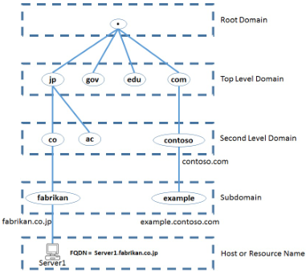
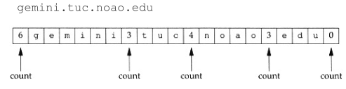
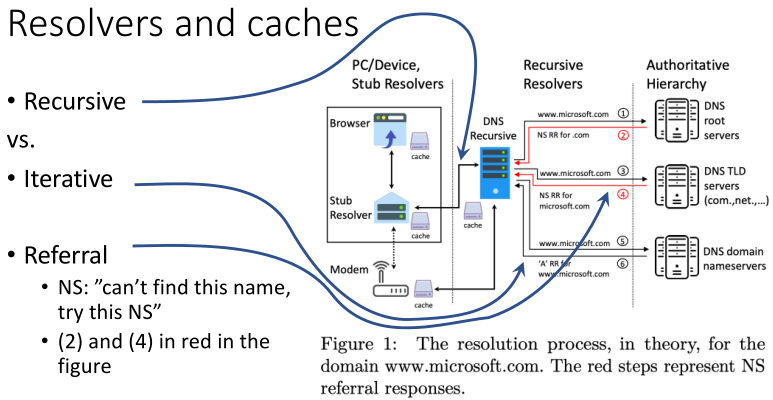
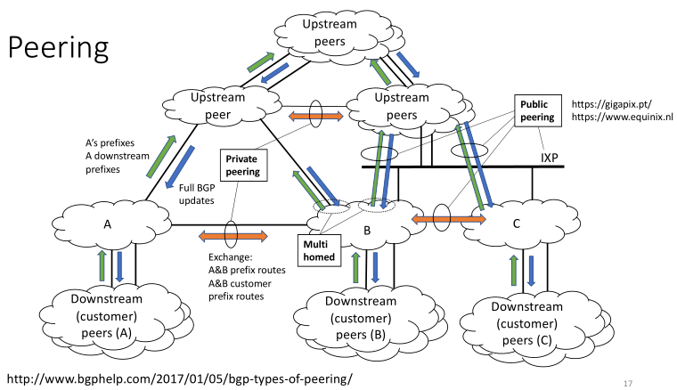
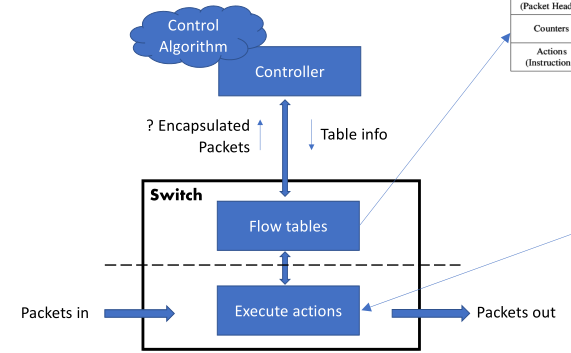
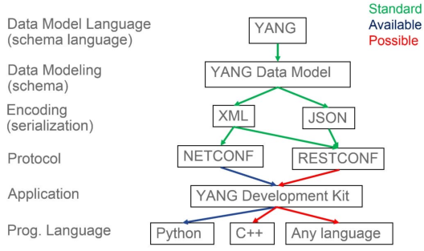
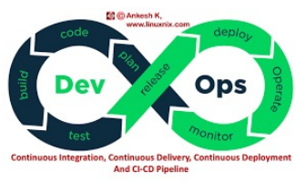
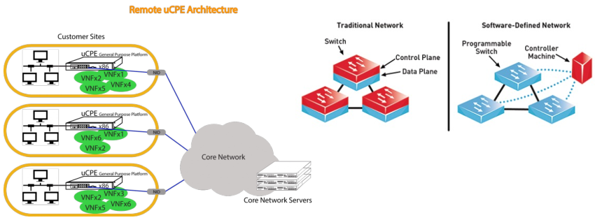
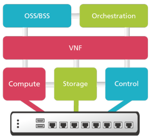

# GRS (short)

## Management vs. Operations

- **Management**:
  - Conceptual, high-level dimensions to keep network running smoothly;
  - **Smoothly**: Quality of Experience (QoE), reliability, security, etc.
  - Manage monitoring, configurations, performance, faults, security,
    accounting, etc.
- **Operations**:
  - People, processes, and tools to make management happen; Typically in the
    network operations center.

## Network planes

- **Data plane**:
  - Packet switch and forwarding (microseconds);
  - Looks up rules, e.g., packet header, in/out interfaces, time-slot;
  - **Protocols**: IP header parsing.
- **Control plane**:
  - **Switching control/Network functions** (milliseconds): routing, Quality of
    Service (QoS), firewall, etc.
  - Reacts to changes (interfaces, links, etc.);
  - Control is centralized or distributed (neighboring routers);
  - Update switching rules;
  - **Protocols**: OSPF, BGP.
- **Management plane**:
  - Orquestração e operação de redes;
  - **Protocols**: Telnet, SSH, SNMP.

## Traditional development vs. DevOps

### Traditional release deployment

- Gather specifications;
- UML architecture diagrams;
- Implement, test, deploy;
- **Fence between _dev team_ and _ops team_**;
- Dev not consider operational requirements;
- Broken deployments => long feedback to dev.

### DevOps approach

- Quick deployment cycle (agile, test-driven, sprints);
- Write code thinking about other phases (deployment, testing, etc.);
- Build rather than buy;
- Automate test and deployment (repeatable and predictable);
- Embrace failure: fail fast, find errors/vulnerabilities, recover quickly.

## FCAPS

Framework for network management.

| Component         | Explanation                                                                                                                                                       |
| ----------------- | ----------------------------------------------------------------------------------------------------------------------------------------------------------------- |
| **Fault**         | Recognize, isolate, correct and log faults in the network                                                                                                         |
| **Configuration** | Focus tracking and managing deployments in a centralized manner. Streamline device configuration and provisioning to ensure quicker configuration and flexibility |
| **Accounting**    | gather usage statistics for users                                                                                                                                 |
| **Performance**   | ensuring performance remains at acceptable levels                                                                                                                 |
| **Security**      | controlling access to assets in the network                                                                                                                       |

**Monitoring entra em todas exceto configuration.**

## Monolithic vs. microservice

### Monolithic

All functionalities of a project exist in a single codebase.

| Good                                         | Bad                                                                                           |
| :------------------------------------------- | --------------------------------------------------------------------------------------------- |
| Simpler to develop                           | Becomes too large with time => difficult to manage                                            |
| Easier to deploy                             | Need to redeploy the whole application with every change                                      |
| Network latency and security not as relevant | High barrier of entry to new devs                                                             |
| Developers focus on single application       | Even if single part is suffering load, need to replicate instances for the entire application |
| --                                           | Difficult to adopt new techs                                                                  |
| --                                           | Not very reliable as single bug can bring everything down                                     |

### Microservices

Architectural development style where the application is made of smaller
services. These communicate with each other directly using lightweight protocols
like HTTP.

| Good                                                                                                              | Bad                                        |
| ----------------------------------------------------------------------------------------------------------------- | ------------------------------------------ |
| Single responsibility                                                                                             | More complex (distributed system)          |
| Built around business capabilities - freedom to choose the best technologies for each business part               | Independent deployment of services is hard |
| Design for failure - designed with failure cases in mind. A single service failing, doesn't bring everything down | Debugging is difficult                     |

## Virtualization vs. containers

| Virtualization                                  | Containers                       |
| ----------------------------------------------- | -------------------------------- |
| Needs hypervisor                                | Shares the OS kernel             |
| Brings a whole system (OS and virtual hardware) | Shared parts are read-only       |
| Moving VMs between clouds can be challenging    | Doesn't allow running other OSes |

## Quality Network

### Application quality requirements

- Capacity (bit/s) - bandwidth intensive applications:
  - Bursts: o quão frequentes e de quão grandes;
  - Capacity vs. throughput vs. goodput.
- Delay - real time, interactive applications:
  - End-to-end delay (control);
  - Round-trip delay (teleconference);
  - Delay variation/jitter - visualization.
- Reliability - mission critical applications:
  - Error rates nos bit/packets;
  - Mean time between failures (MTBF);
  - Mean time to recover (MTTR);
  - Availability = $MTBF / (MTBF + MTTR)$;
  - Uptime(%) = 1 - Availability;

### QoS and traffic engineering

- **Best effort networks**:
  - Não tem preocupações de qualidade (e.g., queues);
  - Serve pacotes por ordem de chegada;
  - Light used => quality OK;
  - Heavily used => quality degradation.
- QoS:
  - Queue management - choose packet, different queues;
  - Load-balancing algorithms - Round-robin, token bucket, RED, etc.
- **Circuit Switching Networks**:
  - Bandwidth is divided into chunks;
  - The Bit delay is constant (during the connection);
  - Once path/circuit is established, data rate is constant;
  - **Admission control** - validation step in communication systems to see if
    there are sufficient resources for the connection.

## Monitoring

- Get a sense of how the network is performing;
- Make sure we're still offering a quality network;
- Essential for **FCAPS**;
- **Short-term measurements**: identify faults, congestions, and attacks;
- **Longer-term measurements**: traffic engineering (reroute or negotiate new
  agreements with peers), upgrade link and device capacity;
- **Accounting** - so you know how each client of the network is using the
  network.

### Passive vs. Active network measurements

- **Passive**:
  - Get a sense of the existing traffic in the network;
  - Have devices report how much traffic is going through (SNMP, netflow);
  - **Port mirroring** - Tap a link or copy traffic to monitoring port;
  - For measuring production traffic and its characteristics.
- **Active**:
  - Inject (new) measurement packets in the network;
  - Get a sense of how the network reacts to these packets;
  - Including responses (e.g., ICMP req/rep for RTT);
  - For measuring the properties of the network (delay, jitter, topology, etc.);
  - **Tools**: ping + traceroute + lperf + owamp + twamp.
- **Não precisamos de ferramentas de medidas passivas para fazer medidas
  ativas**.

## IP Addressing

### Classes

| Class            | Format                                |
| ---------------- | ------------------------------------- |
| A                | `/8`                                  |
| B                | `/16`                                 |
| C                | `/24`                                 |
| Classless (CIDR) | Specify n bits in network part (`/n`) |

### Special cases

| Meaning                     | Address                                         |
| --------------------------- | ----------------------------------------------- |
| **Network address**         | host part all 0s                                |
| **Broadcast address**       | Host part all 1s                                |
| **This network, this host** | `0.0.0.0/8`                                     |
| **Loopback**                | `127.0.0.0/8`                                   |
| **Link local**              | `169.254.0.0/16`, `FE80:0:0:0:<Interface ID>`   |
| **Private, NAT**            | `10.0.0.0/8`, `172.16.0.0/12`, `192.168.0.0/16` |

### Splitting networks

Example: split `200.17.30.0/24` ($2^{32 - 24} = 2^8 = 256$ addresses).

- How many 32 address networks fit in this `/24` network?
- $32 = 2^5 \rightarrow 5$ bits => `/27` network;
- $8 - 5 = 3$ bits for subnetting => $2^3 = 8$ subnets;
- `200.17.30.xxxyyyyy`, where x=subnet, y=host.

### Aggregating networks

Example: is it possible to aggregate any pair of `/27` into one `/26`?

- 2nd and 3rd `/27` subnets;
- 2nd: `200.17.30.32` to `200.17.30.63` - `200.17.30.00|1yyyyy`
- 3rd: `200.17.30.64` to `200.17.30.91` - `200.17.30.01|0yyyyy`
- Even though it is continuous, it doesn't work.

How to?

- Networks must be contiguous: no missing addresses between first and last addr;
- All addrs in same network must have same **network ID bits**.

## DNS (port 53)

- Establish the map between domain names and IPs;
- Answer queries from users:

### Domain name hierarchy

### DNS message format

### Timeouts

- **Expire** - number of seconds after which **secondary name servers** should
  stop answering requests for this zone **if the master does not respond**:
  - Should be higher than $Refresh + Retry$.
- **Refresh** - period of refreshing;
- **Retry** - quanto tempo pode estar sem conseguir dar refresh até dizer
  "primary server failure".

### Resolvers and caches

- Não tem propriamente load-balancing:
  - Cliente tem info de primários + secundários;
  - Pergunta ao primário e depois aos secundários por ordem quando as coisas
    falham.

## Routing

### Centralized routing

- Nodes report link status to central location;
- Central location runs optimization algorithm;
- Return routing table to each router;
- **Uses** => **SDN-like solution** - data centers.

### Distributed routing - algorithms

- **Link state**:
  - Full topology of the network then Dijkstra;
  - Distributed: flood link state announcements - OSPF.
- **Distance vector**:
  - Distance to destination node, Bellman-Ford;
  - Distributed: update distances, resend to neighbors.
- **Path vector**:
  - List of nodes to destination node, local preferences;
  - Distributed: update path vectors, resend to neighbors.

### Interior routing

- Same administrative domain:
  - All networks and devices administered by same entity;
  - Typically the internal network of an organization.
- Protocols:
  - RIP (outdated) - distance vector;
  - EIGRP (Cisco) - distance vector, optimized, hybrid;
  - **OSPF - link state**.

#### OSPF

- Messages:
  - Hello packets between routers to establish adjacency;
  - Link state advertisement, link-state database.
- Designated routers, network adjacency vs. point-to-point link;
- Cost metric manually defined, or multiple of reference bandwidth;
- Backbone area, separate link-state database, Area Border Router.

### Exterior routing

- Different administrative domains:
  - Each node in this network has a different administrator;
  - The Internet;
  - Each node is an Autonomous System - and a network by itself.
- Protocols:
  - **BGP - path vector**.

#### BGP

- **TCP port 179**;
- Messages:
  - Keep-alive;
  - Update.
- Exchange path-vector routes to other BGP routers:
  - For each network;
  - Select one route, announce it to neighbors, add it to routing table.
- Route map: set of rules to check what to do with route:
  - Drop route, modify route, and add it to the routing table.
- Uses route selection criteria, e.g.:
  - Weight - local to each router;
  - AS-local preference for route - local to each AS;
- Authentication: MD5 hash of password;
- IP header TTL set to 1;
- Route aggregation: `32.32.32.0/24`, `32.32.33.0/24` announced as
  `32.32.32.0/23`

### Peering

## Software Defined Networking (SDN)

### Switch

- No control, just forwarding.

| Default Behaviors                      | Description                                                                      |
| -------------------------------------- | -------------------------------------------------------------------------------- |
| drop all                               | :(                                                                               |
| send to default processing             | Switch SDN da cisco pode trazer a stack de software da cisco                     |
| encapsular e mandar para o controlador | útil para definir regras on-the-fly (controlador analisa pacote e manda decisão) |
| forward para o output                  | :)                                                                               |

### Features of SDN

- Hardware abstraction - Control works on any hardware that implements API;
- Programmable:
  - Hardware/software bundles só permitem config de existing control algorithms;
  - SDN allows us to develop our own algorithms.
- Centralized control of policies:
  - Security policies, e.g., "node of type X can only talk with nodes of type
    Y";
  - Routing policies, e.g., "route guest traffic through the firewall";
  - QoS policies, e.g., "prioritize voice traffic".

## Device API and Automation tools

### Building blocks

- module – top of the hierarchy of nodes
- containers – related nodes
- lists – identifies nodes
- leaf – individual attributes of a node
- type – every leaf has an associated type

## CI/CD

- Version control - found a problem with code => get back to older version that
  worked;
- Agile - divide in small parts, implement;
- Pipeline - workflow of code delivery process.

### Steps

### Types of code

- **Application code** - the software you want to run (including docker/VM
  image);
- **Infrastructure code** - code that you write to set up the infrastructure;
- **Live infrastructure config** - frontend for infrastructure deployments.
  Parametrized for a particular deployment.

### Code vs. build

- Some languages have a straight forward distinction (C or Java). Source code
  vs. executable binaries;
- Need a build phase for infrastructure?
  - Depends on the language of the infrastructure code and tools;
  - We actually deploy configuration files.

### Test

- **Unit test** - Sandbox or dry run tests of individual
  components/configurations;
- **System test** - Deploy the different network components and test their
  interactions;
- **Staging environment** - Replica of production environment.

### Release vs. deployment

- **Release** - software product ready to be deployed;
- **Deployment** - release configured for the target environment;
- For infrastructure, the difference is we're dealing with configuration instead
  of software.

## Network Function Virtualization (NFV)

- Não é SDN;
- Pode ser feita usando SDN ou VLANs;

### Customer-premises white box (uCPE)

- Run VNFs as VMs or container;
- E.g., DHCP, Routing, NAT, etc.

